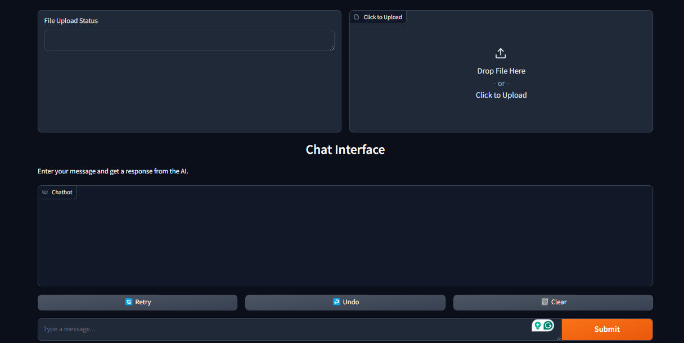

# Chat with Your Data


This repository implements a Retrieval-Augmented Generation (RAG) system using `llama-index`, `langchain`, and `huggingface`. It allows users to chat with their own data using advanced language models.

## Features

- RAG implementation with `llama-index` and `langchain`
- Integration with Hugging Face models
- Quantized version of `phi-3-mini-4k-instruct` as the main LLM
- Custom embedding model for vector database
- User-friendly chat interface

## Demo

### UI Screenshot


### Working Demo


## Quick Start

### Google Colab

Try out the project in Google Colab:
- [RAG with phi-3-mini-4k-instruct](https://colab.research.google.com/drive/1PaAavml6xQaVRUmw9iAIdfXTz4ezM7d8?usp=sharing)

### Local Setup

1. Clone the repository:
   ```
   git clone https://github.com/yourusername/chat-with-your-data.git
   cd chat-with-your-data
   ```

2. Install dependencies:
   ```
   pip install -r requirements.txt
   ```

3. Run the application:
   ```
   python -m rag1.ui
   ```

## Components

- **Main LLM**: Quantized version of `phi-3-mini-4k-instruct`
- **Embedding Model**: Custom model for vector database
- **RAG Framework**: Combination of `langchain` and `llama-index` for loading and creating vector indexes

## Completed Features

- [x] Chat history integration
- [x] LoRA support for model fine-tuning

## Roadmap

- [ ] Implement RAG from scratch
- [ ] Add CPU support with quantization
- [ ] Integrate more mini models
- [ ] Improve documentation and add usage examples
- [ ] Optimize performance and reduce memory usage
- [ ] Add support for multiple data sources

## Contributing

Contributions are welcome! Please feel free to submit a Pull Request.

## Acknowledgements

- Hugging Face for providing the `phi-3-mini-4k-instruct` model
- The teams behind `llama-index` and `langchain` for their excellent libraries
